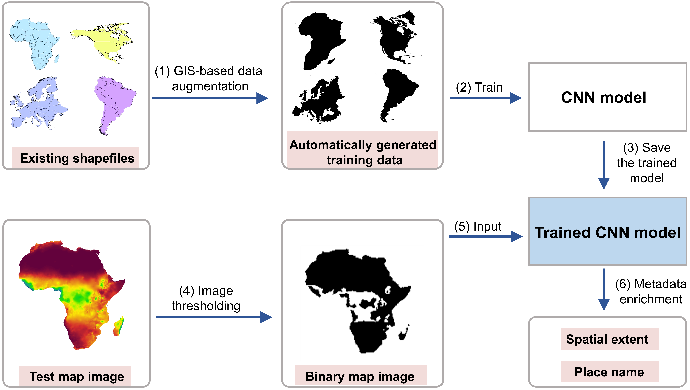
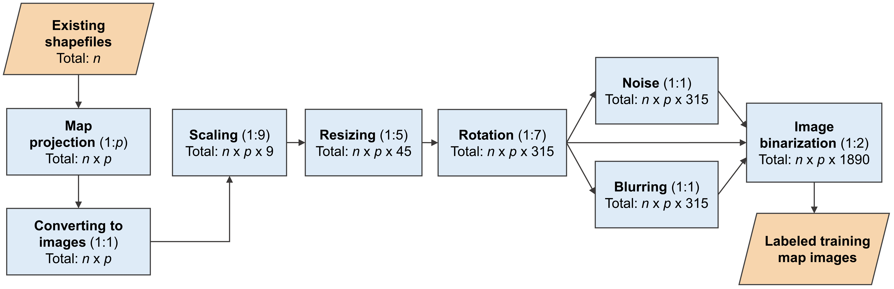
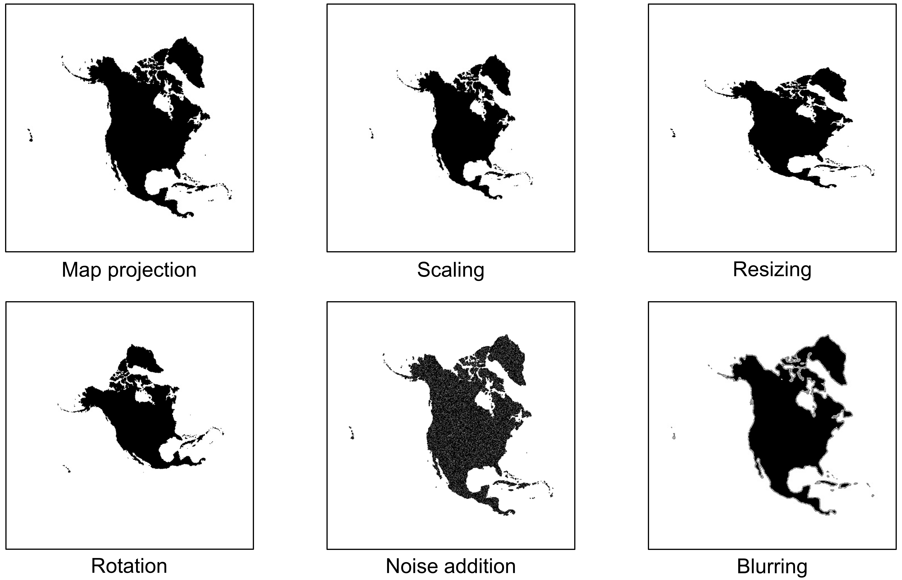
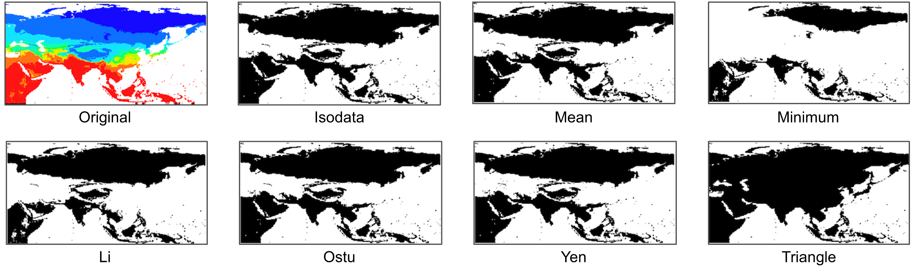

# Enriching the metadata of map images: a deep learning approach with GIS-based data augmentation

### Overall description
This paper introduces a deep learning approach, enhanced by GIS-based data augmentation, to enrich the metadata of digital map images, which are commonly available through geoportals, web pages, and other sources. Map metadata, including spatial extents and place names, are crucial for accurate indexing and searchability. However, many map images either lack metadata or contain incorrect information. A key challenge in applying deep learning models to address this issue is the need for large, manually labeled datasets. To overcome this, the proposed approach leverages GIS operations to automatically generate labeled training data from shapefiles, reducing the manual effort required.

The approach is applied to enhance map metadata by extracting spatial extents and place names directly from map images. Multiple deep learning models are trained on this augmented dataset and evaluated using two datasets: a Web Map Service image dataset at the continental scale and an online map image dataset at the state scale. The paper discusses both the benefits and limitations of this GIS-based data augmentation method.

Additionally, the code and test map datasets used in this work are available in a public repository. Further details can be found in the accompanying documentation.

<br />
<br />

<p align="center">

<br />
Figure 1. A summary of the methodological framework for enhancing map image metadata.
</p>

<br />
<br />

<p align="center">

<br />
Figure 2. GIS-driven data augmentation process for creating labeled training map images.
</p>

<br />
<br />

<p align="center">

<br />
Figure 3. Outcomes of various data augmentation techniques applied to the same map.
</p>


<br />
<br />

<p align="center">

<br />
Figure 4. Comparison of seven distinct thresholding techniques applied to the same map image.
</p>


<br />


### Repository organization

"Training_data" folder: This folder contains the shapefiles used for automatically generating labeled training data. The shapefiles are located in the "shapefiles" subfolder. Other subfolders, such as "base_image," are designated for storing the generated training images but are currently empty.

"Test_data" folder: This folder houses two datasets of map images for testing:

"DataAugmentation" folder: Contains the Python source code implementing the workflow for automatically generating labeled training images.

"Image_Thresholding" folder: Contains the Python code for performing image thresholding on the test map images.

"CNNs" folder: Includes the Python source code for two tasks:

Retraining three pre-trained CNN models on the generated training data.
Evaluating the trained models using the test datasets.


### Automatic training dataset construction
Below, we outline the key steps involved in constructing a labeled training dataset. For further details, please refer to the comments in the source code.

#### First step: Map projection

This step involves applying map projection transformations to the shapefiles for each class. The original shapefiles, which are in WGS84 format, are located in the "/Training_data/shapefiles" subfolder. The transformed shapefiles are then saved as images in the "/Training_data/base_image" folder.

```bash
	python prj_operation.py
```

#### Second step: Image augmentation

This step creates labeled training images through a series of operations, including scaling, resizing, rotation, blurring, adding noise, and binarization. The resulting training dataset is stored in the "/Training_data/image_set" folder.

```bash
	python Image_augmentation.py
```

### Apply image thresholding on the test maps

This step converts RGB test map images into binary images using the Triangle Thresholding method. Ensure that the continental-level maps are located in the "/Test_data/Continents" folder. Then, run the Thresholding.py script. After processing, the generated binary map images will be available in the "/Binary_maps/Continents" subfolder.
```bash
	python Thresholding.py
```

### Train the CNN models on the augmented data set

#### Prepare the pre-trained CNN models
Here's a summary of the TensorFlow models available for different networks:

Network	TensorFlow Model
AlexNet	Model (240 MB)
Inception-V3	Model (92 MB)
ResNet-50	Model (103 MB)

#### Train the CNN model

Run the two Python scripts in order:

```bash
     python preprocess.py
     python train.py
```

This process retrains the pre-trained CNN model on the generated training images. The weights of the re-trained model are saved into the "Outputs" folder.


### Test the trained models on test map images

#### Default model with SoftMax output

Run prediction.py (inside each CNN model folder) to classify the test maps in the eight classes (the "Noise" class is not included in this part) using the trained CNN model:

```bash
    python prediction.py
```

The outputs include:
(1) The classification accuracy for each class
(2) Error analysis by displaying the incorrect classification distribution on other classes
(3) The overall classification accuracy on the test data set


```bash
	python prediction.py
```

The outputs include:
(1) "train_scores.npy": the output vectors of fc10 layer (the last fully connected layer of ResNet) when processing the training images
(2) "mavs.npy": the average scores of "train_scores.npy"
(3) "test_scores.npy": the output vectors of fc10 layer (the last fully connected layer of ResNet) when processing the test images

 
Then run the following codes in the "/OpenMax" folder:

```bash
     python calc_dist.py
     python test_openmax.py
```

The outputs include:
(1) The classification accuracy for each class but will add one "Noise" category
(2) Error analysis by displaying the incorrect classification distribution on other classes
(3) The overall classification accuracy on the test data set


### Project dependencies:

* Python 3.6+
* Keras 2.3.0
* Tensorflow 1.8.0+
* OpenCV-Python
* scikit-image
* GeoPandas
* scipy, joblib, libmr (Optional if to use OpenMax)
* The rest should be installed alongside these major libraries
